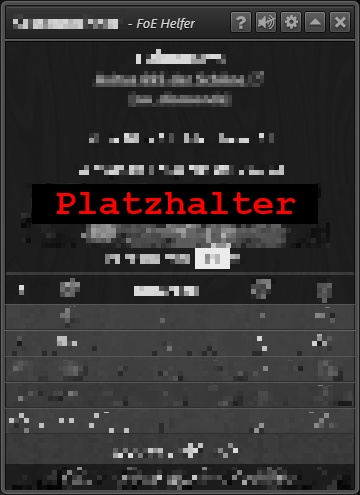

# Gildenexpedition
Dieses Modul zeigt die erreichten Leistungen der eigenen Gilde und deren Gegner während der aktuellen und der zurückliegenden Runden der Gildenexpedition. Für die eigene Gilde wird auch der individuelle Beitrag aller Gildenmitglieder angezeigt. Darüber hinaus können die Daten auf den eigenen Rechner heruntergeladen werden. 

Das Modul wird über das nachfolgend abgebildete Icon gestartet:

 

## Überblick
+ Die Auswahl der anzuzeigenden Daten erfolgt über das Anklicken eines der Reiter **Rangliste**, **Mitgliederbeteiligung** oder **Verlauf**.
+ Die Anzeige der Daten für Rangliste und Mitgliederbeteiligung erfolgt für jeweils eine GEX-Runde. 
  Der gewünschte Zeitraum kann im Auswahlfeld der Zeile **GEX Woche** eingestellt werden (Pull-down-Menü oder Buttons).
+ Der Verlauf zeigt eine grafische Darstellung über die Ergebnisse der zurückliegenden GEX-Runden.

 

## Rangliste

## Mitgliederbeteiligung

## Verlauf

## Datenexport
